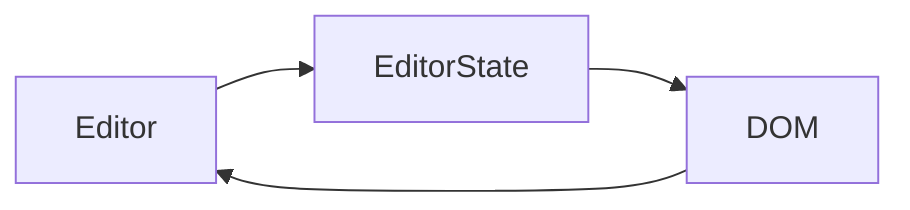

## Overview

[Lexical](https://lexical.dev/) の学習用リポジトリです。

> Note: Lexical is currently in early development and APIs and packages are likely to change quite often.

上の通り、変更がよく起こる可能性があるため注意してウォッチする必要がある。

<br>

## Lexical Concenpt

Lexical の主なコンセプトは、エディタの状態(editor state)です。Lexical では、一貫性と信頼性を確保するために、ダブルバッファリングという手法を採用しています。エディタ状態は 2 つ以上存在することはありません。current editor state は、画面上で目に見えるものを表し、pending editor state は、将来表示されるように現在構築中のものを表します。pending editor state が準備できると、それは入れ替わり、新しい current editor state になります。

**Lexical core の 4 つの関心事**

- Updates : エディタの状態を変更する行為
- Node Transforms : 進行中の更新に対処するプロセス
- Reconcilation : DOM に最新のエディタステートを適用するプロセス
- Listening/Commands : 内部で発生した変更に反応するプロセス

**更新プロセス**

`LexicalEditor`が内部で`_editorState`と`_pendingEditorState`を保持しており、差分比較して DOM を描画しているよう。DOM を変更して文字を見せているのでなく、editorState を変更して DOM を変更する。

```javascript
// コアのAPI
class LexicalEditor {
  _editorState: EditorState // 現在のEditorState
  _pendingEditorState: null | EditorState // pendingのEditorState
  // ...etc
}
```

`EditorState`が実際に DOM に描画したいデータモデル。

```javascript
class EditorState {
  _nodeMap: NodeMap // node tree
  _selection: null | RangeSelection | NodeSelection | GridSelection // selection
  // ...etc
}

type NodeMap = Map<NodeKey, LexicalNode>
```

`Editor`と`EditorState`と`DOM`は一連のプロセスでつながっている。



<br>

### Base Nodes

`LexicalNode` という単一の核となる node があり、以下の 5 つの node が派生する.
`RootNode` `LineBreakNode` `ElementNode` `TextNode` `DecoratorNode`

```javascript
class RootNode extends ElementNode {
  // ...etc
}

class LineBreakNode extends LexicalNode{
  getTextContent(): '\n';
  // ...etc
}

type ElementFormatType = 'left' | 'center' | 'right' | 'justify'; // text-align
class ElementNode extends LexicalNode {
  __children: Array<NodeKey>;
  __format: number;
  __indent: number;
  __dir: 'ltr' | 'rtl' | null;
  // ...etc
}

class TextNode extends LexicalNode {
  __text: string;
  __format: number;
  __style: string;
  toggleFormat(type: "bold" | "underline" ...etc): TextNode;  // typeを変える関数
  // ...etc
}
```

| node              | description                                                                                                                                                                                                                                                                                                                                                                                                                                                                            |
| ----------------- | -------------------------------------------------------------------------------------------------------------------------------------------------------------------------------------------------------------------------------------------------------------------------------------------------------------------------------------------------------------------------------------------------------------------------------------------------------------------------------------- |
| **RootNode**      | 常に階層の一番上にあり、`contenteditable`そのもの。親や兄弟を持たない。                                                                                                                                                                                                                                                                                                                                                                                                                |
| **LineBreakNode** | `\n`の代わりに使われる。                                                                                                                                                                                                                                                                                                                                                                                                                                                               |
| **ElementNode**   | 他の node の親として使用される。ブロックレベル (`ParagraphNode`, `HeadingNode`) およびインライン (`LinkNode`) にすることができます。                                                                                                                                                                                                                                                                                                                                                   |
| **TextNode**      | `format` bold, italic, underline, strikethrough, code, subscript and superscript の任意の組み合わせのフォーマット <br>`mode` <br> &nbsp; - `token` immutable な node で削除不可 <br> &nbsp; - `inert` contenteditable=false に設定されているので、カーソルを中に入れたり、部分的に選択したりすることができません。<br> &nbsp; - `segmented` コンテンツがセグメント単位で削除され、編集が可能です。 <br>`style` インライン CSS スタイルをテキストに適用するために使用することができます |
| **DecoratorNode** | エディタ内に任意のビュー（コンポーネント）を挿入するためのラッパーノードです                                                                                                                                                                                                                                                                                                                                                                                                           |

<br>

### Selection

Selection はエディターの選択状態を表現するモデルです。選択だけでなく、キャレット(編集エリアでピコピコしている縦棒のこと)状態も Selection で管理されます。
Lexical の Selection は EditorState の一部です。
つまり、エディタが更新されたり、変更されたりするたびに、選択範囲は常に EditorState のノードツリーのものと一致するようになります。

Lexical では、次の 4 種類の選択が可能。`RangeSelection` `NodeSelection` `GridSelection` `null`。
基本的に`RangeSelection`が適用される。

**※公式ドキュメントが整備されてない**

```javascript
type PointType = { key: number, offset: numberl, type: 'text' | 'element' } // keyは選択しているLexical NodeのNodeKeyを指す
class RangeSelection {
  anchor: PointType // 始点
  focus: PointType // 終点
  dirty: boolean
  format: number
}
```

<br>

### Listeners, Node Transforms and Commands

アップデートの実行以外では、Lexical で行われる作業の大部分は、`listeners`, `node transforms` and `commands` を経由して行われます。
これらはすべてエディタに由来し、register というプレフィックスがつきます。

<br>

**Listeners**

Listeners はエディターインスタンスが特定の操作が発生したときにユーザーに通知するメカニズムです。

**Commands**

Commands は、Lexical のすべてを結びつけるための通信システムです。
カスタムコマンドは `createCommand()`で作成し、`editor.dispatchCommand(command, payload)`でエディタにディスパッチすることが可能です。

**Node Transforms Lifecycle**

変更が DOM に伝搬される前に順次実行され、複数の変換は依然として単一の DOM 照合（Lexical のライフサイクルで最も高価な操作）につながる。


<br>

### Editor State

Editor State は DOM 上に表示したいものを表す基礎となるデータモデルです。以下の 2 つの part を含む。

- a Lexical node tree
- a Lexical selection object

現在の Editor State は`editor.getEditorState()`で取得できる。
また Editor State は JSON にシリアライズ可能。反対に`editor.parseEditorState()`で元の Editor State に戻すことができる。

<br>

### Editor Updates

Editor State を変更したい場合は`editor.update(() => {...})`を使用して更新しなければいけない。
この時 lexical で用意されている$ prefixed functions を使用することが公式で推奨されている。

<br>

### DOM Reconciler

独自の DOM reconciler があり Editor State の current と pending を受け取り、差分を適用する。
この差分を用いて DOM の変更すべき部分のみを変更する。**(React みたい)**

<br>

### Read Only Mode

初期から readOnly にしたい場合は initialConfig の readOnly を true にする(`initialConfig={{readOnly: true}}`)
後で変更したい時は`editor.setReadOnly(true);`を実行する。

<br>

### Creating custom Lexical nodes

[Creating custom decorator nodes](https://github.com/facebook/lexical/blob/main/examples/decorators.md)
<br>
テキスト以外は decorator nodes の使いコンポーネントをエディタに埋め込む必要がある。

[custom node を作るプロセス](https://lexical.dev/docs/concepts/nodes)

<br>

## Plugins

| plugin                            | description                                                                                                                     |
| --------------------------------- | ------------------------------------------------------------------------------------------------------------------------------- |
| **LexicalRichTextPlugin**         | editing, including typing, deletion, copy/pasting, indent/outdent and bold/italic/underline/strikethrough をサポート            |
| **LexicalHistoryPlugin**          | undo / redo を管理する                                                                                                          |
| **LexicalLinkPlugin**             | テキストを Link にする変換する`toggleLink`をサポート                                                                            |
| **LexicalAutoLinkPlugin**         | url を自動的に Link に変換する                                                                                                  |
| **LexicalListPlugin**             | 順序付きおよび順序なしリストのサポート                                                                                          |
| **LexicalCheckListPlugin**        | チェックリストをサポート                                                                                                        |
| **LexicalMarkdownShortcutPlugin** | headings, lists, code blocks, quotes, links and inline styles (bold, italic, strikethrough)の markdown ショートカットをサポート |

<br>

## 参考記事

- [Meta の新しいリッチテキストエディターフレームワーク Lexical を調べる (この記事の概念の説明が分かりやすい)](https://zenn.dev/stin/articles/getting-started-with-lexical)
- [Facebook 製エディタ Lexical を試してみたよ！](https://zenn.dev/haruru/articles/0fc3577325cd88)
- [Facebook 製エディタ Lexical を試してみたよ！（２） 機能追加してみた！](https://zenn.dev/haruru/articles/12206977dc0c48)
- [sereneinserenade/lexical-comments](https://github.com/sereneinserenade/lexical-comments)
- [codesandbox 実装例](https://codesandbox.io/s/lexical-rich-text-example-5tncvy?file=/src/Editor.js)
- [内部で yjs を使ってる](https://github.com/facebook/lexical/blob/f3c5e8bc6897dabfcebd13112e57c253c7d325e7/packages/lexical-yjs/src/index.js)

<br>

## Issue (詰まったポイント)

- 内部で ts 使ってる訳ではなく flow を使ってる。
- linsters と commands と node transforms のプロセスがよくわからん。
- 親から props として editorState を渡し、それを描画する方法。
- 画像を表示したい場合は ImageNode を作り Decorator で wrap する必要があるみたい。

<br>

## Deploy

- [Cloudflare Pages](https://lexical-pra.pages.dev/)
